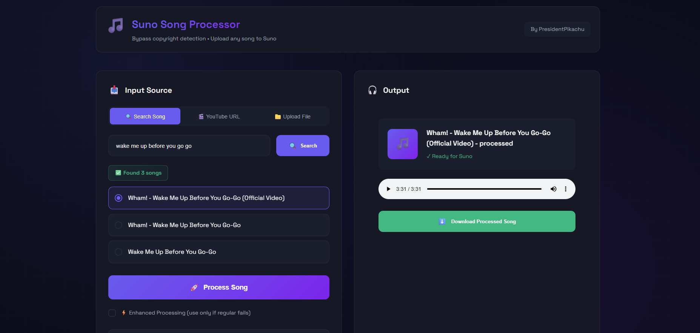

# SUNO Cover Song Processor - PreProcess ANY song for suno upload



Standalone app for song processing to Bypass uploads restrictions in suno. works with direct search (full process including download from youtube and processing the file), youtube urls, or local files.

## Install

### Standalone Windows App
**Windows:** [Download Installer](https://drive.google.com/file/d/1PTsVYCmu55f8A7dQsd1hijTN1e5DF7yS/view?usp=sharing)

### From Source
```bash
git clone https://github.com/Ido108/sunocover.git
cd sunocover
```

**Windows:** `setup.bat`
**Mac/Linux:** `chmod +x setup.sh && ./setup.sh`

Requires: Python 3.10+

## Run

**Windows:** `start.bat`
**Mac/Linux:** `./start.sh`

Opens automatically

## Usage

Upload an audio/youtube url, it will start the process right away (if suno not accepting the first output, try the enhanced process, it'll work.)

Note- IGNORE the error message of dependency conflicts (of audio-separator) if exist in installation. It will work fine.

## Credits 🙏

- [nomadkaraoke](https://github.com/nomadkaraoke) - Author of [python-audio-separator](https://github.com/nomadkaraoke/python-audio-separator/) Thank you!
- [Kuielab & Woosung Choi](https://github.com/kuielab) - Developed the original MDX-Net AI code.
- [PseudoRAM](https://github.com/nomadkaraoke) - Author of Author of [RVC-v2-UI](https://github.com/PseudoRAM/RVC-v2-UI/) Thank you!
